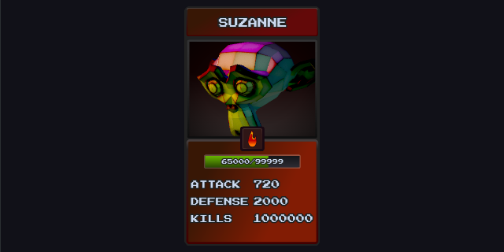

# 3d gui rt sample project

Shows how to display 3d in GUI via render target.

*Click the image to play the demo on itch.io*

 

**How it works:**

- render target uses depth/stencil.

- render target resource is referenced in 3D.render and applied to bootstrap in game.project

- rt_view game object holds the Suzanne model and script

- model. script calculates a view using rt_view position and sends it and projection to render script.

- in the render script the rt resource is referenced to draw to using "character" predicate and depth/stencil test is used.

- In the gui a material named rt_gui added and applied to node where the rt will be displayed.

- in the render script the predicate gui3d is used to draw to the gui.

- render target is resized on window resizing. 

**Project Specifics- notes**

 The sample project is very simple but in a bigger project there are things to note when adding 3d to your gui.

- Things you may want to think about, do the 3d animations you are wanting to display need to be real-time or can they be calculated before hand? May be simpler to pre-render animation and use an atlas if your budget allows for it.

- In the sample 2 predicates are used in the render script one to draw to render target and another to draw to the gui separate from the gui predicate. Instead it may be better to draw the render target to an atlas and assign the image in the atlas to the gui node eliminating the need for another draw call, material etc. instead use the gui predicate. This may also eliminate the need to resize the rt, less work in the render script. Here defold forum user d954mas shares this method.
[forum.defold.com/t/defold-1-7-0-has-been-released/76266/18](https://forum.defold.com/t/defold-1-7-0-has-been-released/76266/18)

- It's important to think about how the rt will be displayed will the window be able to be resized etc. This may affect the way it is displayed and need to be adjusted.

-------------------

LEARN MORE ABOUT THE DEFOLD GAME ENGINE:

Check out [the documentation pages](https://defold.com/learn) for examples, tutorials, manuals and API docs.

If you run into trouble, help is available in [the Defold forum](https://forum.defold.com).

Happy Defolding!

---

Credit:

Willem-Paul van Overbruggen -- creator of the Suzanne 3d model